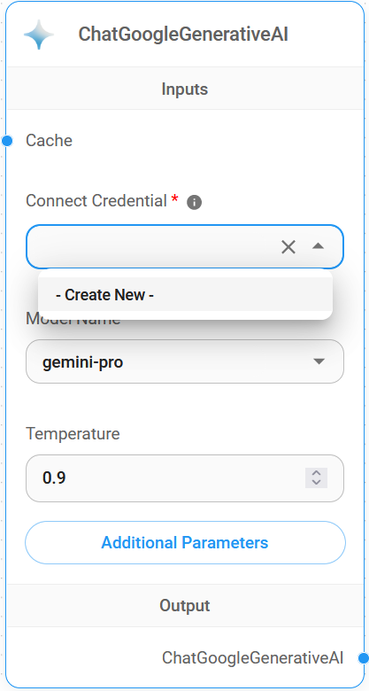
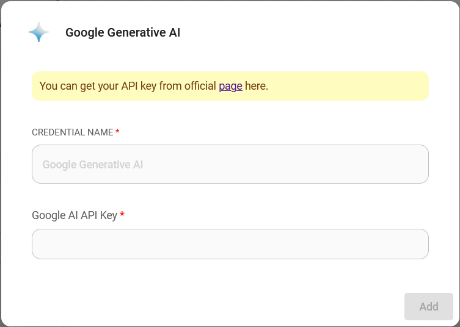
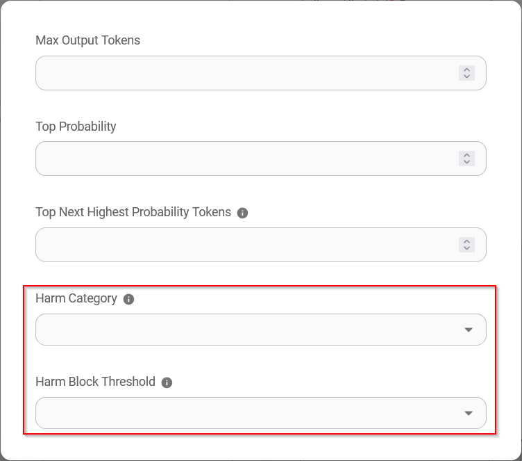

# ChatGoogleGenerativeAI

## Prerequisite

1. Register a [Google](https://accounts.google.com/InteractiveLogin) account
2. Create an [API key](https://aistudio.google.com/app/apikey)

## Setup

1. **Chat Models** > drag **ChatGoogleGenerativeAI** node

2. **Connect Credential** > click **Create New**

3. Fill in the **Google AI** credential

4. Voila [🎉](https://emojipedia.org/party-popper/), you can now use **ChatGoogleGenerativeAI node** in Flowise

## Safety Attributes Configuration

1. Click **Additonal Parameters**

* When configuring **Safety Attributes**, the amount of selection in **Harm Category** & **Harm Block Threshold** should be the same amount. If not it will throw an error `Harm Category & Harm Block Threshold are not the same length`

* The combination of **Safety Attributes** below will result in `Dangerous` is set to `Low and Above` and `Harassment` is set to `Medium and Above`

## Resources

* [LangChain JS ChatGoogleGenerativeAI](https://js.langchain.com/docs/integrations/chat/google_generativeai)
* [Google AI for Developers](https://ai.google.dev/)
* [Gemini API Docs](https://ai.google.dev/docs)