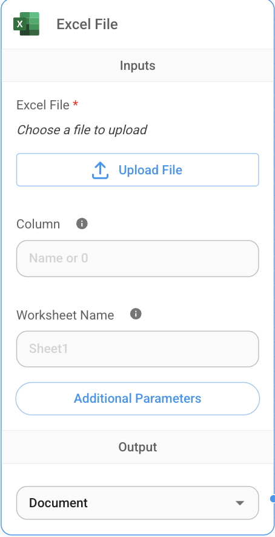

# Flowise Excel Node

This custom Flowise node enables dynamic creation, styling, and export of Excel `.xlsx` files. It is ideal for generating formatted reports from Flowise pipelines based on LLM output, structured data, or external inputs.

---




# How to use Excel Node

- Upload File : Provide the .xlsx file as the input.
- Column : specify the column name or column index (eg: 'Name' or '0'). if nothing is specifed then it extracts all the columns.
- worksheet Name : If multiple files are present in excel specify the sheet or by default it consider first sheet.
- output - It should selected as JSON.

---
# Usecase

---

## Quickstart to create Excel Node in flowise

### 1. Clone & Install
```bash
git clone <your-repo-url>
cd flowise-excel-node
pnpm install
```

### 2. Build & Run Locally
```bash
pnpm build
pnpm dev
```

### 3. Use in Flowise
Add the node to your Flowise UI as a custom node. Input data must include:

```json
{
  "cell": "B2",
  "value": "Hello from Flowise!",
  "style": {
    "font": {
      "bold": true,
      "color": "FF0000"
    },
    "fill": {
      "patternType": "solid",
      "fgColor": "FFFF00"
    }
  }
}
```

Output: an Excel buffer that can be streamed, stored, or offered for download.

---

## Project Structure

| File                   | Description                          |
|------------------------|--------------------------------------|
| `Excel.ts`            | Entry point, orchestrates Excel generation and styles |
| `Worksheet.ts`        | Manages cells and worksheet structure|
| `Cell.ts`             | Represents individual Excel cell     |
| `Cell_Style.ts`       | Combines font, fill, number format   |
| `Cell_Style_Font.ts`  | Font options                         |
| `Cell_Style_Fill.ts`  | Background fill styles               |
| `NumberFormat_Style.ts`| Number formatting                   |
| `utils.ts`            | Helper functions                     |

### Detailed Explanation: `Excel.ts`

This module acts as the central orchestrator for creating a styled Excel worksheet.

- Instantiates a `Worksheet` object
- Accepts Flowise-style input with cell coordinates, values, and styles
- Calls `setCell()` on the worksheet, passing value and style
- Serializes the worksheet to a `.xlsx` buffer via `toBuffer()`

### Detailed Explanation: `Worksheet.ts`

Handles the core logic of managing Excel worksheet content.

- Maintains an internal grid (map) of `Cell` objects keyed by cell reference (e.g. `A1`, `B2`)
- Implements:
  - `setCell(cellRef: string, value: any, style?: Cell_Style)` – Writes a new value and optional style to the cell
  - `toBuffer()` – Serializes the entire worksheet into an XLSX-compliant buffer
- Handles ordering, sheet structure, and integration with XML/ZIP-based XLSX format

### Detailed Explanation: `Cell.ts`

Represents a single cell in the worksheet.

- Contains two main properties:
  - `value: any` – the content to display (string, number, date, etc.)
  - `style: Cell_Style` – encapsulated object defining how the cell looks
- Provides:
  - `toXML()` – returns the cell’s XML structure for use in workbook serialization

### Detailed Explanation: `Cell_Style.ts`

Acts as a container for all style information applicable to a cell.

- Contains:
  - `font: Cell_Style_Font` – defines font appearance
  - `fill: Cell_Style_Fill` – background or pattern fill
  - `numberFormat: NumberFormat_Style` – how to display numeric values
- Abstracts Excel’s verbose style definition to a simple TypeScript object
- Used as a shared style interface between node input and rendering logic

### Detailed Explanation: `Cell_Style_Font.ts`

Provides a model for font styling.

- Options include:
  - `name: string` – font family (e.g., Arial)
  - `bold: boolean`
  - `italic: boolean`
  - `size: number` – font size
  - `color: string` – hex color (e.g., `FF0000`)
- Consumed by `Cell_Style` and used to generate `<font>` XML tags

### Detailed Explanation: `Cell_Style_Fill.ts`

Controls the background fill of a cell.

- Properties:
  - `type: 'pattern'` – (currently fixed to pattern)
  - `patternType: string` – e.g., `solid`
  - `fgColor: string` – fill color in hex
- Supports full fill customization for emphasis or design purposes

### Detailed Explanation: `NumberFormat_Style.ts`

Defines how numeric or date values appear.

- Property: `formatCode: string`
  - Example: `#,##0.00` for two decimal precision
- Maps to Excel’s `numFmtId` values in exported XML

### Detailed Explanation: `utils.ts`

A helper module that supports:

- Conversions between formats (e.g., column number to letter)
- Shared constants or validation logic
- Encapsulation of repetitive or low-level tasks

---

## Testing
We recommend using [Vitest](https://vitest.dev/) or Jest:

```ts
import { describe, it, expect } from 'vitest';

describe('Cell', () => {
  it('should serialize to XML', () => {
    const cell = new Cell('Test');
    expect(cell.toXML()).toContain('<v>Test</v>');
  });
});
```

---

## Extendability

You can extend this node by:
- Adding new style types (e.g., borders, alignment)
- Supporting multiple worksheets per workbook
- Enabling template loading with `loadTemplate(buffer)`

---
