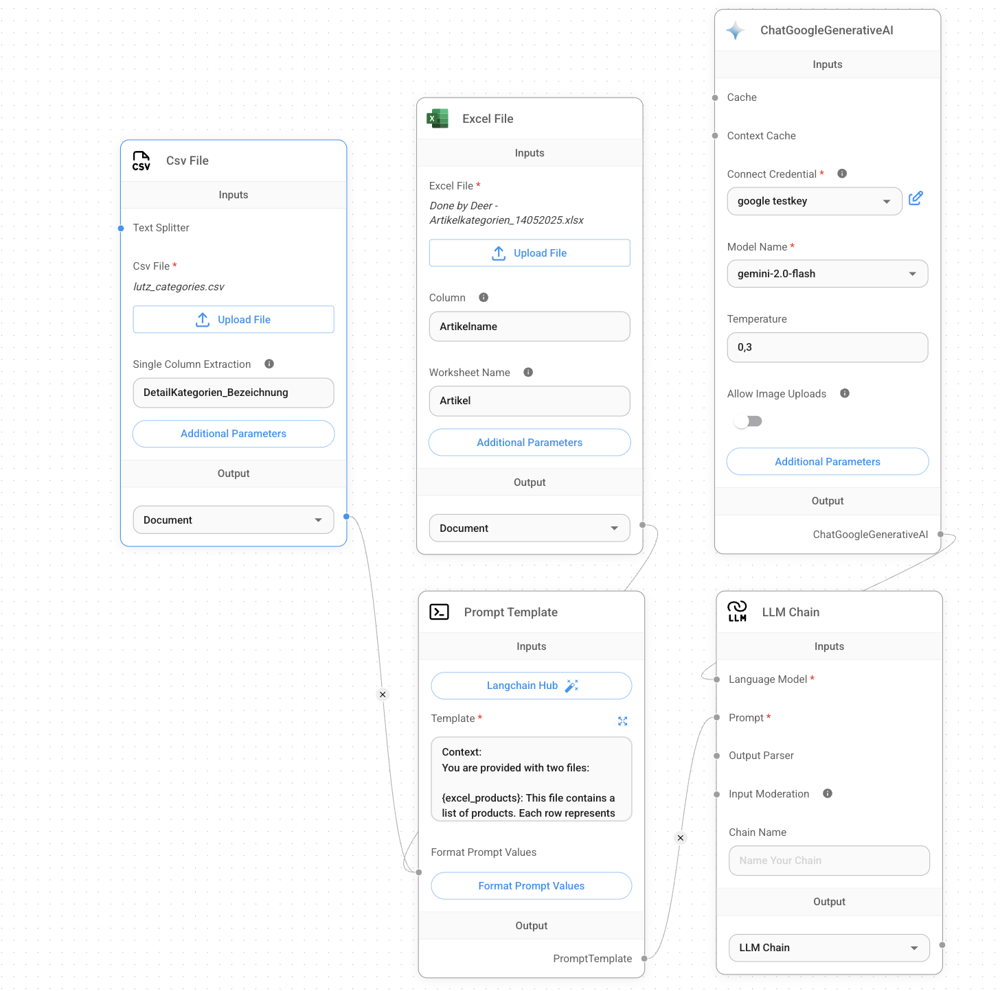

# Excel File

Excel (XLSX/XLS) files are widely used to store structured data in spreadsheet format. This module provides functionality to load and process Excel files within your Flowise workflows.

This module offers a robust Excel document loader that can:

- Load single or multiple Excel files  
- Support both base64-encoded files and files from storage  
- Extract specific columns or entire worksheet contents  
- Handle large Excel datasets efficiently  
- Support advanced metadata management  

---

## Inputs

- **Excel File**: The Excel file(s) to process (`.xlsx` or `.xls` format required). Can be uploaded directly or retrieved from storage.

- **Column (optional)**: The name of a specific column to extract from the Excel sheet. Only the values from this column will be used in the output.

- **Worksheet Name (optional)**: The name of the worksheet to process. If not specified, the first worksheet in the Excel file will be used by default.

- **Additional Metadata (optional)**: A JSON object with extra metadata fields to attach to each document generated from the Excel file.

- **Omit Metadata Keys (optional)**: Comma-separated list of metadata keys to exclude from the default metadata included in the output.


---

## Outputs

- **Document**: Array of document objects, each including metadata and `pageContent` extracted from the Excel file

- **JSON**: Parsed JSON representation of the Excel data for downstream processing or inspection

---

## Features

- Support for processing multiple Excel files simultaneously  
- Ability to extract content from a single specified column  
- Efficient parsing of large and complex Excel workbooks  
- Flexible metadata management (add or omit metadata fields as needed)  
- Integration with base64 file input and file storage systems  
- Customizable handling of worksheet names and content structure  

------

## Example Use Case: Product Categorization Agent Using Excel and CSV Nodes

This example demonstrates how to build an agent in Flowise that reads product data from an Excel file and matches each product to the most appropriate detail category defined in a separate CSV file.

### Objective

Automatically assign a detail category to each product based on descriptive attributes such as name, brand, or description.

---

### Flow Overview

The workflow consists of the following nodes:

- **CSV File Node**: Loads a CSV file (`categories.csv`) containing detail category definitions with keywords or rules.  
- **Excel File Node**: Loads an Excel file (`Artikelkategorien.xlsx`) with a product list to be categorized.  
- **Prompt Template Node**: Crafts a structured prompt that describes the categorization task and format expectations.  
- **ChatGoogleGenerativeAI Node**: Uses the `gemini-2.0-flash` model to process the input and perform category matching.  
- **LLM Chain Node**: Executes the final LLM call with the structured prompt and returns categorized results.

---

## Real-World Scenario: Automated Product Categorization

### Background

A product data analyst at a retail company is tasked with organizing a large catalog of products into specific detail categories for better internal tagging and search optimization. The product information is stored in an Excel file, while category definitions and rules are maintained in a CSV file.

Manually matching thousands of product entries to their corresponding categories is time-consuming and error-prone. The analyst decides to build an intelligent automation workflow using Flowise.

---

### Goal

To automatically classify each product into the most appropriate **Detail Category** based on its name, brand, and description using AI.

---

### Setup

- **Product Data File**:  
  `Artikelkategorienxlsx` (Excel file)  
  Worksheet: `Artikel`  
  Column Extracted: `Artikelname`  
  Contains: List of products with metadata fields like product name, brand, etc.

- **Category Definitions File**:  
  `categories.csv` (CSV file)  
  Column Extracted: `DetailKategorien_Bezeichnung`  
  Contains: Descriptions of detail categories and associated keyword criteria.

- **AI Model Used**:  
  `gemini-2.0-flash` from Google Generative AI, integrated via Flowise’s LLM node.

---

### Workflow

1. **Excel Node** reads product entries from the specified worksheet and column.
2. **CSV Node** loads category definitions with optional filtering or metadata customization.
3. A **Prompt Template** combines both data sources into a structured context and set of instructions for the LLM.
4. The **LLM Chain Node** processes the data using the Gemini model to generate the category mapping.
5. Output is returned in structured JSON format, one category per product.

---

### Sample Output

```json
[
  "Kitchen Utensils",
  "Baby Products",
  "Home Decor",
  "Uncategorized"
]


